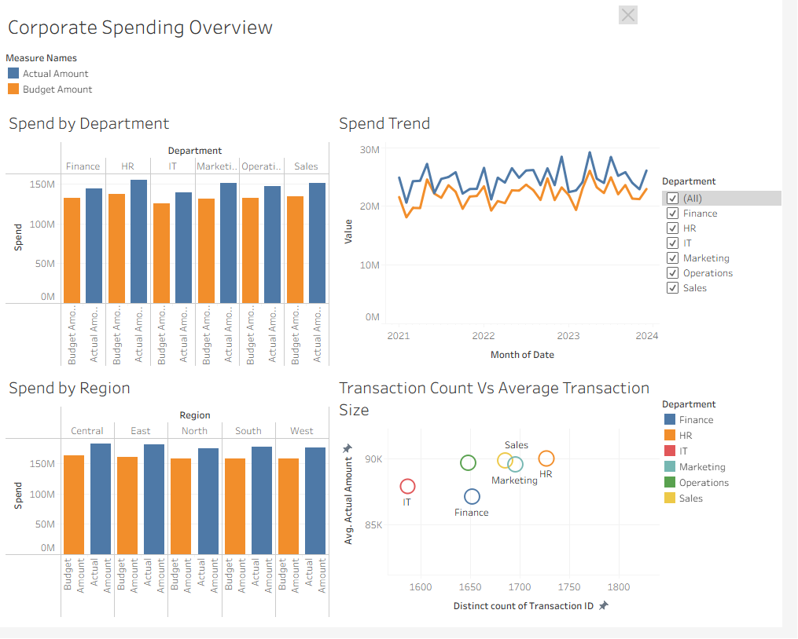
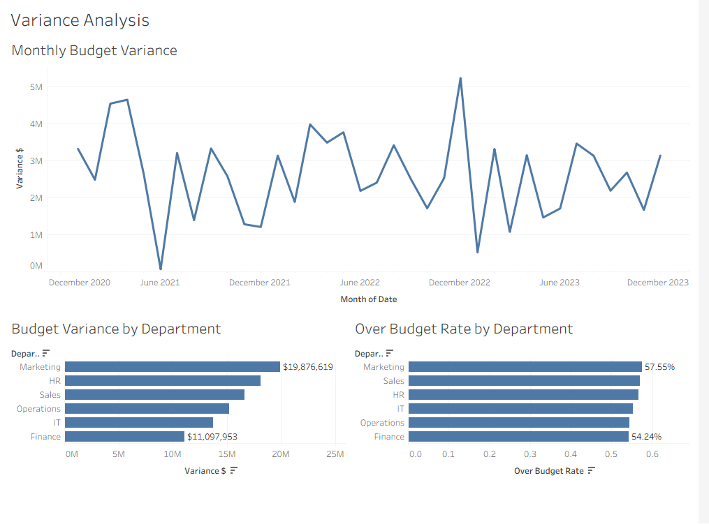

# Finance Budget Variance Tableau Model

This repository contains a Tableau budget-versus-actual model for corporate expense variance analysis. It packages a cleaned Excel transaction dataset, a Tableau packaged workbook, dashboard screenshots, and supporting source notes.

The project is built around a common FP&A question: where is spending above plan, and which departments, categories, regions, and transactions are driving the variance?

## Dashboard Preview

### Corporate Spending Overview



### Variance Analysis



## Project Files

- [Tableau packaged workbook](workbook/Budget%20vs%20Actual%20Tableau%20workbook.twbx)
- [Cleaned Excel dataset](data/Budget_vs_Actual_Data_clean.xlsx)
- [Original project notes](docs/README_Corporate_Budget_Actual_source_notes.md)
- [Corporate spending overview screenshot](assets/corporate-spending-overview.png)
- [Variance analysis screenshot](assets/variance-analysis.png)

## Data Source

The underlying dataset is sourced from Kaggle:

> **[Corporate Budget vs. Actual Dataset](https://www.kaggle.com/datasets/atharvasoundankar/corporate-budget-vs-actual-dataset)** — Atharva Soundankar, Kaggle

The raw data was lightly cleaned (duplicates removed, nulls verified) before being loaded into Tableau. See the cleaned file in `data/` and the original source notes in `docs/`.

## Business Context

The workbook analyzes simulated corporate spending from January 1, 2021 through December 31, 2023. Each transaction includes department, expense category, region, payment method, budget amount, actual amount, and transaction ID.

The dashboard is designed for recurring budget review conversations, especially:

- Monitoring actual spend against budget over time
- Identifying departments with the largest unfavorable variances
- Comparing high-spend areas against high-variance areas
- Distinguishing frequent budget misses from large one-off misses
- Drilling from executive-level trends into transaction-level detail

## Dataset Summary

| Metric | Value |
|---|---:|
| Cleaned transactions | 9,995 |
| Unique transaction IDs | 9,995 |
| Date range | 2021-01-01 to 2023-12-31 |
| Departments | 6 |
| Expense categories | 6 |
| Regions | 5 |
| Payment methods | 4 |
| Duplicate full rows after cleaning | 0 |
| Missing values after cleaning | 0 |

## Data Fields

| Field | Description |
|---|---|
| Date | Transaction date |
| Department | Finance, HR, IT, Marketing, Operations, or Sales |
| Category | Infrastructure, Marketing, Salaries, Training, Travel, or Utilities |
| Region | Central, East, North, South, or West |
| Budget Amount | Planned transaction amount |
| Actual Amount | Recorded transaction amount |
| Payment Method | Bank Transfer, Card, Cash, or UPI |
| Transaction ID | Unique transaction identifier |

## Tableau Workbook

The packaged Tableau workbook includes two dashboards:

- `Corporate Spending Overview`
- `Variance Analysis`

It also includes ten worksheets:

- Budget Variance by Department
- Department and Category Matrix
- Monthly Budget Variance
- Over Budget Rate by Department
- Spend Trend
- Spend by Category
- Spend by Dept
- Spend by Region
- Top 10 Transactions
- Transaction Count Vs Average Transaction Size

## Calculated Fields

### Variance $

```tableau
[Actual Amount] - [Budget Amount]
```

Positive values indicate actual spending exceeded budget.

### Variance %

```tableau
([Actual Amount] - [Budget Amount]) / [Budget Amount]
```

### Over Budget Flag

```tableau
IF [Actual Amount] > [Budget Amount] THEN 1
ELSE 0
END
```

### Over Budget Rate

```tableau
SUM([Over Budget Flag]) / COUNTD([Transaction ID])
```

## Key Findings

| KPI | Value |
|---|---:|
| Total budget | $795.1M |
| Total actual spend | $889.8M |
| Unfavorable variance | $94.6M |
| Aggregate variance % | 11.9% |
| Transactions over budget | 5,587 |
| Overall over-budget rate | 55.9% |
| Average actual transaction | $89,020 |
| Largest actual transaction | $169,973 |

### Annual Performance

| Year | Budget | Actual | Variance | Variance % |
|---:|---:|---:|---:|---:|
| 2021 | $256.6M | $287.4M | $30.8M | 12.0% |
| 2022 | $266.3M | $302.6M | $36.3M | 13.6% |
| 2023 | $272.2M | $299.8M | $27.6M | 10.1% |

2022 produced the largest total budget overrun and the highest variance percentage.

### Department Findings

| Department | Budget | Actual | Variance | Variance % | Over-Budget Rate |
|---|---:|---:|---:|---:|---:|
| Marketing | $131.9M | $151.8M | $19.9M | 15.1% | 57.5% |
| HR | $137.4M | $155.4M | $18.1M | 13.2% | 56.7% |
| Sales | $134.7M | $151.3M | $16.6M | 12.4% | 57.0% |
| Operations | $132.6M | $147.8M | $15.2M | 11.5% | 54.4% |
| IT | $125.7M | $139.4M | $13.7M | 10.9% | 55.3% |
| Finance | $132.8M | $143.9M | $11.1M | 8.4% | 54.2% |

HR recorded the highest actual spending, but Marketing generated the largest unfavorable variance. That distinction matters because the highest-spend area is not necessarily the area most responsible for the budget miss.

### Category Findings

- Utilities recorded the highest actual spend at $155.3M.
- Salaries generated the largest category variance at $20.6M.
- Salaries finished 16.2% above budget.

### Regional Findings

- Central recorded the highest actual spend at $182.0M.
- East generated the largest regional variance at $21.4M.
- East finished 13.4% above budget.

### Monthly Variance Hot Spots

The largest monthly overrun was December 2022, with a $5.2M unfavorable variance and a 22.6% variance rate. Other high-variance months included April 2021, March 2021, March 2022, May 2022, and April 2022.

## Dashboard Design Notes

- Actual and budget are paired where direct comparison matters.
- Variance is separated when the difference itself is the primary measure.
- Department over-budget rate is shown separately from total variance to separate frequency from magnitude.
- The transaction count versus average transaction size scatterplot separates spend volume from transaction value.
- A regional bar chart is used instead of a map because the source data contains directional regions, not precise geography.
- Top transactions are shown as a detail table to support drill-down and audit review.

## How to Use

1. Download or clone the repository.
2. Open `workbook/Budget vs Actual Tableau workbook.twbx` in Tableau Desktop or Tableau Public.
3. Use the dashboard filters and worksheet interactions to explore spend by department, category, region, and time period.
4. Review the cleaned Excel file in `data/` if you want to inspect or refresh the source data.

## Repository Structure

```text
finance-budget-variance-tableau/
|-- assets/
|   |-- corporate-spending-overview.png
|   `-- variance-analysis.png
|-- data/
|   `-- Budget_vs_Actual_Data_clean.xlsx
|-- docs/
|   `-- README_Corporate_Budget_Actual_source_notes.md
|-- workbook/
|   `-- Budget vs Actual Tableau workbook.twbx
`-- README.md
```

## Limitations

- The dataset is simulated and should be treated as a portfolio analytics project, not a real company record.
- Budget values exist at the transaction level; real FP&A budgets are often maintained by cost center, account, owner, and period.
- Every month aggregates above budget, which suggests the source data is structurally biased toward overspending.
- The dataset does not include vendor, GL account, owner, headcount, forecast, or prior-year actuals.
